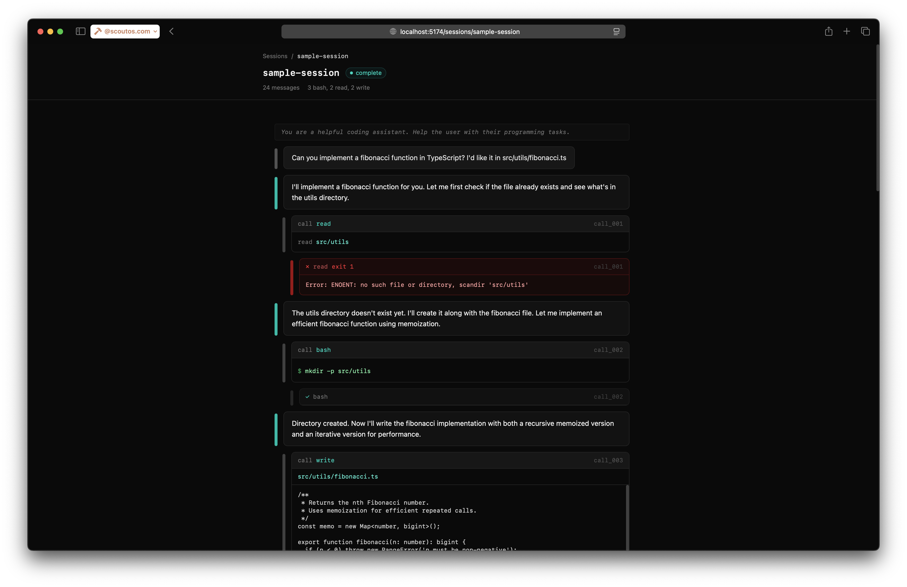

# Session Studio

A clean, dark-themed web interface for visualizing agent-runner sessions. Drop in your `.jsonl` session files and explore agent reasoning, tool calls, and results in a readable, interactive timeline.



## Quick Start

```bash
git clone <repo-url> session-studio
cd session-studio
bun install
bun run start
```

Open [http://localhost:3030](http://localhost:3030).

## Configuration

| Variable      | Default      | Description                            |
|---------------|--------------|----------------------------------------|
| `SESSION_DIR` | `./sessions` | Directory containing `.jsonl` files    |
| `PORT`        | `3030`       | Port for the HTTP server               |

Example:

```bash
SESSION_DIR=/path/to/my/sessions PORT=8080 bun run start
```

## Development

```bash
bun run dev
```

Starts the Hono API server and Vite dev server concurrently. The client proxies `/api` requests to the server and supports hot module replacement.

## Adding Sessions

Point `SESSION_DIR` at any directory containing agent-runner `.jsonl` output files:

```bash
SESSION_DIR=~/agent-runs bun run start
```

Each `.jsonl` file becomes a session in the list. Session Studio reads them directly — no import step needed.

## Tech Stack

- **Server:** [Bun](https://bun.sh) + [Hono](https://hono.dev)
- **Client:** [React](https://react.dev) + [Tailwind CSS](https://tailwindcss.com) + [Vite](https://vitejs.dev)
- **Data:** Filesystem `.jsonl` files — no database

## Related

- [agent-runner](https://github.com/dottie-weaver/agent-runner) — the lightweight agent runtime that produces the `.jsonl` sessions this tool visualizes
